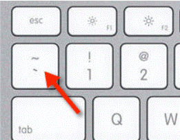
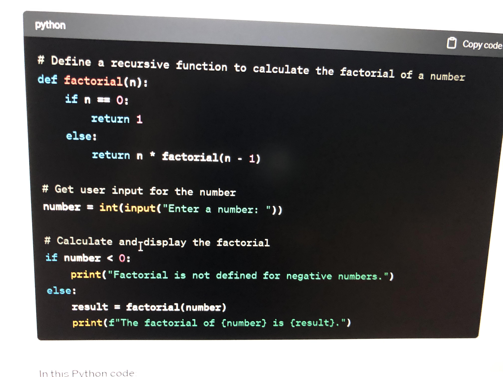
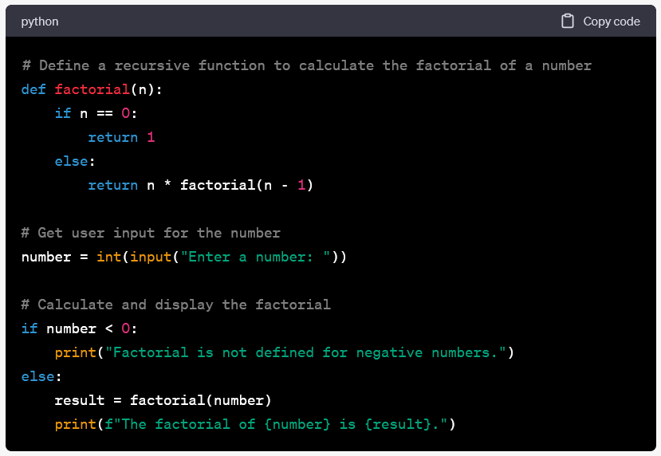
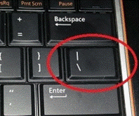

# Writing Good Documentation


## Step 1 - Using Codeblocks

Codeblocks in markdown make it *very easy* for technical people to **copy, paste and share** code.
A good Cloud Engineer uses Codeblocks whenever possible.

This allows others to copy and paste their code in order  to replicate or research issues.


- In order to create codeblocks in markdown, you need to use three bacticts (`)
- Not to be confused with the quotation mark (')

```
# Define a recursive function to calculate the factorial of a number
def factorial(n):
    if n == 0:
        return 1
    else:
        return n * factorial(n - 1)

# Get user input for the number
number = int(input("Enter a number: "))

# Calculate and display the factorial
if number < 0:
    print("Factorial is not defined for negative numbers.")
else:
    result = factorial(number)
    print(f"The factorial of {number} is {result}.")
```

- When you can, you should attempt to apply syntax highlighting to your codeblocks

```python
# Define a recursive function to calculate the factorial of a number
def factorial(n):
    if n == 0:
        return 1
    else:
        return n * factorial(n - 1)

# Get user input for the number
number = int(input("Enter a number: "))

# Calculate and display the factorial
if number < 0:
    print("Factorial is not defined for negative numbers.")
else:
    result = factorial(number)
    print(f"The factorial of {number} is {result}.")

```
- Make note of where the backtick keyboard key is located.
- It usually appears above the Tab key, but it may vary based on your keyboard type.




Good Cloud Engineers use codeblocks for both Code and Errors that appear in the console.

```bash
Traceback (most recent call last):
  File "example.py", line 2, in <module>
    print(undefined_variable)
NameError: name 'undefined_variable' is not defined
```

> Here is an example of using a codeblock for an erroe that occurred in bash.


When you can, always provide a codeblock instead of a screenshot.
If you need to take a screenshot, make sure it is not a photo from your phone.

> There are certain cases where it is okay to take photos with your phone. This is when you are showing something like a keyboard which does not appear on your computer screen. If it is rendered on your computer, it should be a screenshot. 

## Step 2 - How to take screen shots

A screen shot is when you capture a part of your screen from your laptop, desktop or phone.

This is not to be confusted with taking a photo with your phone.

**DO NOT DO THIS!**




This is an example of a screenshot from your computer.

**DO THIS INSTEAD**

 


Taking screenshots on a Windows computer can be done in several ways, depending on your needs and the version of Windows you're using. Here are some common methods:

1. **Snipping Tool (Windows 7 and later)**:
   - Snipping Tool is a built-in screenshot utility in Windows. You can find it in the Start menu.
   - Open Snipping Tool, click "New," and then select the area of the screen you want to capture.
   - After capturing the screenshot, you can annotate it and save it.

2. **Snip & Sketch (Windows 10 and later)**:
   - Snip & Sketch is another built-in tool that allows you to take screenshots and annotate them.
   - Press `Win + Shift + S` to open Snip & Sketch, select the area you want to capture, and then annotate or save the screenshot.

3. **Print Screen (PrtScn or PrtSc)**:
   - The Print Screen key on your keyboard (usually labeled as PrtScn or PrtSc) captures the entire screen to the clipboard.
   - Press `PrtScn` to capture the whole screen or `Alt + PrtScn` to capture only the active window.
   - Paste the screenshot into an image editor (e.g., Paint) and save it.

4. **Snipping Tool (Legacy)**:
   - If you're using Windows 7, you can use the original Snipping Tool found in the Start menu.
   - Open it, select the type of snip (e.g., rectangular, freeform), capture the screenshot, and save it.

5. **Windows + Shift + S (Windows 10 and later)**:
   - Press `Win + Shift + S` to open a snipping toolbar at the top of the screen.
   - Select the type of snip you want, capture the screenshot, and it will be copied to the clipboard.

6. **Windows + Print Screen (Windows 8 and later)**:
   - Press `Win + PrtScn` to capture the entire screen and automatically save it as a file in the "Screenshots" folder of your Pictures library.

7. **Snip & Sketch (Tablet Mode)**:
   - If you're using Windows in tablet mode, swipe in from the right edge of the screen, tap "Screen snip," and then capture the screenshot.

8. **Third-Party Tools**:
   - There are many third-party screenshot tools available, such as Greenshot, Lightshot, and ShareX, which offer additional features and customization options.

After taking a screenshot, you can usually paste it into an image editor or an application like Paint to edit or save it. Additionally, many of these methods allow you to annotate the screenshot before saving it, which can be useful for highlighting or adding text to the image.


## Step 3 - Use GitHub Flavored Markdown Task Lists

GitHub extends Markdown to have a list where you can check off items.[^1]

- [x] Finish Step 1
- [x] Finish Step 2
- [x] Finish Step 3

## Step 4 - Use Emojis (Optional)

GitHub Flavored Markdown (GFM) supports emoji shortcodes.[^2]
Here are some examples:

| Name | Shortcode | Emoji |
| -------- | ------- | ------- |
| Cloud | `:cloud:` | :cloud: | 
| Smiling Face | `:smile:` | :smile: |
| Thumbs Up | `:thumbsup:` | :thumbsup: |

## Step 5 - How To Create A Table

You can use the following markdown format to create tables:

```markdown
| Name | Shortcode | Emoji |
| -------- | ------- | ------- |
| Cloud | `:cloud:` | :cloud: | 
| Smiling Face | `:smile:` | :smile: |
| Thumbs Up | `:thumbsup:` | :thumbsup: |

```
GitHub extends the functionality of Markdown tables to provide more aligment and table cell formatting options.[^3] 

- Make note of where the pipe keyboard key is located.
- It usually appears above the return or enter key, but it may vary based on your keyboard type.
  


[Secret_Window_Hidden_Garden](secret-window/hidden-garden.md)

## External References

[GitHub Flavored Markdown Spec](https://github.github.com/gfm/) 

[Basic Writing & Formatting Syntax (Github Flavored Markdown)](https://docs.github.com/en/get-started/writing-on-github/getting-started-with-writing-and-formatting-on-github/basic-writing-and-formatting-syntax#quoting-text)


**Footnotes**
[^1]:[GFM - Task Lists](https://docs.github.com/en/get-started/writing-on-github/getting-started-with-writing-and-formatting-on-github/basic-writing-and-formatting-syntax#task-lists)

[^2]:[GFM - Emoji Cheatsheet](https://github.com/ikatyang/emoji-cheat-sheet)

[^3]:[GFM - Tables (with extentions)](https://github.github.com/gfm/#tables-extension-)
